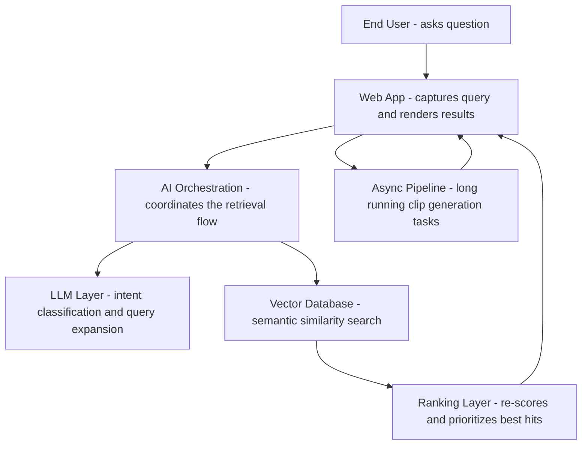
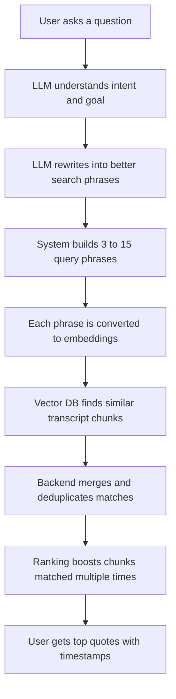
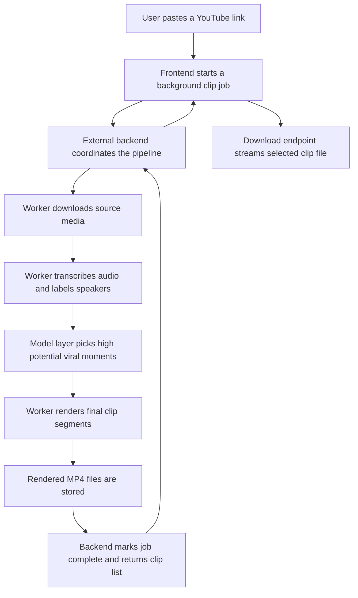

# SamGPT (Sam's Brain) 🧠

> Ask one question. Instantly surface the best Sam Parr moments, with timestamped proof.


## Why This Exists

Podcast content is high-value and high-volume, but hard to search when you need answers fast.

`SamGPT` turns long-form conversations into an AI-powered discovery engine:
- Find the exact quote, not just the episode.
- Jump to the exact timestamp, not just a summary.
- Go from research to publishable clips in one workflow.

Example prompts:
- *"Find where I found something really funny."*
- *"Any cool predictions I got right that I can talk about today?"*
- *"What's a guest idea that actually impressed me?"*
- *"Find some cool ideas I can repurpose for short form."*

## How It Works

Under the hood, this is a modern retrieval architecture with clear layers and strong separation of concerns.



### LLM + Semantic Retrieval Deep Dive



### Async Clip + Download Pipeline (External Backend)

This pipeline is handled by an external backend service (configured via `NEXT_PUBLIC_CLIPPING_API_URL`), not by this repository.



## Why It Matters

This project is built for people who care about speed, signal, and shipping:
- **Faster insight extraction**: ask naturally, get precise moments with context.
- **Higher content leverage**: turn long episodes into short-form opportunities quickly.
- **Production-ready AI stack**: orchestration layer, LLM layer, vector retrieval, deterministic ranking, async jobs.
- **Real user experience**: polished interface, clear loading states, direct links, and clip workflows.

### Technology Used

- **App framework**: Next.js `16`, React `19`, TypeScript
- **UI system**: Tailwind CSS `v4`, Headless UI, Lucide icons
- **LLM + embeddings**: OpenAI `gpt-4o-mini`, `text-embedding-3-small`
- **Data platform**: Supabase PostgreSQL + `pgvector`
- **Media pipeline integration**: external async clipping service (`/viral-clips`, `/clip`, `/recent-videos`)

## Get Started

Run it locally:

```bash
npm install
npm run dev
```

Create `.env.local`:

```bash
OPENAI_API_KEY=your_openai_key
SUPABASE_URL=your_supabase_url
SUPABASE_KEY=your_supabase_anon_or_service_key
NEXT_PUBLIC_CLIPPING_API_URL=http://localhost:8000
```

Then open the app, ask a real question, and explore the moments worth sharing.

---

Built for the MFM community and creator tooling workflows.
